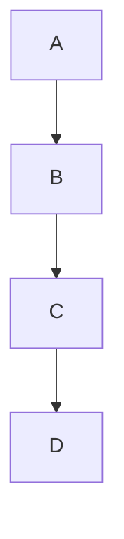

# Project Title

## Overview

This project is designed to solve specific problems using various algorithms.

## Installation

```bash
# Install dependencies
npm install
```

## Usage

```javascript
// Example usage of the project
console.log('Hello World!');
```

## Mermaid Diagram

