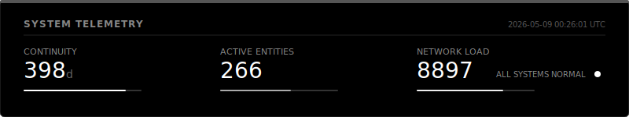

  

# AIX Format

**The Artificial Intelligence eXchange Protocol**
*Standardizing Agent Deployments & M2M Communication*

 

 

  <h3 style="color: #ffffff; font-family: -apple-system, BlinkMacSystemFont, 'Segoe UI', Roboto, sans-serif; margin-top: 0;">01. CORE PROTOCOL</h3>
  

    <strong>AIX is a portable, encrypted, and schema-validated deployment protocol for AI Agents.</strong> It establishes a deterministic standard for structuring agent capabilities, enabling zero-trust Machine-to-Machine (M2M) transactions securely.
  

  <h4 style="color: #ffffff; font-family: -apple-system, BlinkMacSystemFont, 'Segoe UI', Roboto, sans-serif; font-size: 14px; margin-top: 20px;">Architecture Highlights</h4>
  <ul style="color: #888888; font-family: -apple-system, BlinkMacSystemFont, 'Segoe UI', Roboto, sans-serif; font-size: 13px;">
    <li><strong>AxiomID (Detached Manifests):</strong> Immutable identity hashes separate from capabilities.</li>
    <li><strong>Cryptographic Signatures:</strong> Ed25519/secp256k1 payloads preventing Sybil attacks.</li>
    <li><strong>Universal Compatibility:</strong> Serializes seamlessly to YAML, JSON, and TOML.</li>
    <li><strong>M2M Economics:</strong> Native structuring for inter-agent value exchange.</li>
  </ul>

  <h4 style="color: #ffffff; font-family: -apple-system, BlinkMacSystemFont, 'Segoe UI', Roboto, sans-serif; font-size: 14px; margin-top: 20px;">Minimal Working Example</h4>
  <pre style="background: #050505; border: 1px solid rgba(255,255,255,0.05); padding: 15px; border-radius: 4px; overflow-x: auto; color: #cccccc; font-family: 'JetBrains Mono', 'Fira Code', monospace; font-size: 12px; text-align: left;">
{
  "aix_version": "0.4.0",
  "axiom_id": "aix_1z8...x9p",
  "capabilities": ["execute_code", "read_db"],
  "signature": "ed25519:7b3...f1a"
}
  </pre>

 

  <strong>بروتوكول تبادل الذكاء الاصطناعي (AIX).</strong> المعيار الأساسي لنشر وكلاء الذكاء الاصطناعي وتواصلهم. بنية تحتية لامركزية، مشفرة، وتعتمد على التحقق الدقيق من المخططات (Schemas) لتأمين المعاملات بين الآلات.

   

<h3 style="color: #ffffff; font-family: -apple-system, BlinkMacSystemFont, 'Segoe UI', Roboto, sans-serif; font-size: 14px; letter-spacing: 1px; border-bottom: 1px solid rgba(255,255,255,0.1); padding-bottom: 5px; max-width: 800px; text-align: left; margin-bottom: 20px;">SYSTEM TELEMETRY</h3>

<!-- START_LIVE_DATA -->

| Metric | Value | Status |
| :--- | :--- | :--- |
| **System Uptime** | `395 days` | 🟢 OPERATIONAL |
| **Active Agents** | `228` | 🟢 ONLINE |
| **Network Payload** | `6486 ops` | 🟢 STABLE |
| **Last Sync** | `2026-04-29 12:21:03 UTC` | 🔒 VERIFIED |

 

<!-- END_LIVE_DATA -->

   

    

        King isn't Born, he is Made.
    

    

        Operating at the intersection of complex math and raw compute. The goal is 10x, or it's not worth the logic.
    

    

        العمل عند تقاطع الرياضيات المعقدة وقوة الحوسبة الخام. الهدف هو مضاعفة التأثير 10 مرات، أو أن الأمر لا يستحق عناء المنطق.
    

