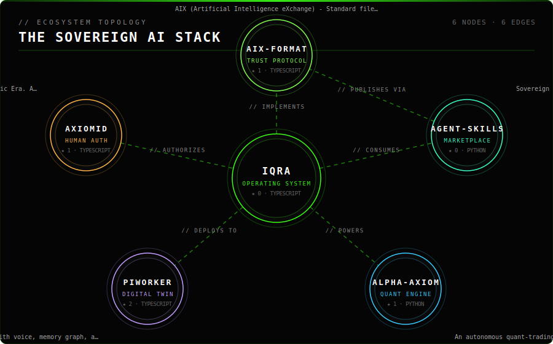

 

# MOHAMED HOSSAM-ELDIN ABDELAZIZ
### محمد حسام الدين عبدالعزيز

**`■ SOVEREIGN AI ARCHITECT & SYSTEMS ENGINEER`**
 
`مهندس نظم ومعماريات ذكاء اصطناعي مستقلة`

 

  

  

 

> **EN ·** *"Building systems that outlive their creators. Establishing self-evolving ecosystems and sovereign AI infrastructure."*
>
> **AR ·** *"بناء أنظمة تعيش أطول من صانعيها. إنشاء أنظمة بيئية ذاتية التطور وبنية تحتية مستقلة للذكاء الاصطناعي."*

 

  

 

## `01.` THE MISSION  ·  المهمة

**EN ·** Building a **Sovereign AI Stack**: a unified ecosystem where autonomous agents are portable, cryptographically secure, and economically self-sustaining. Six projects compose the stack across two tiers — three flagship layers (a sovereign operating system, an open exchange format, and a marketplace of vetted skills) and three supporting systems (a local-first digital twin, an autonomous quant engine, and a human-authorization identity protocol).

**AR ·** بناء **منظومة ذكاء اصطناعي سيادية**: نظام بيئي موحَّد يكون فيه الوكلاء المستقلون قابلين للنقل، آمنين تشفيرياً، ومستدامين اقتصادياً ذاتياً. تتكوّن المنظومة من ستة مشاريع على طبقتين: ثلاث طبقات رئيسية (نظام تشغيل سيادي، معيار تبادل مفتوح، وسوق للمهارات الموثَّقة) وثلاثة أنظمة داعمة (توأم رقمي محلي، محرّك تداول كمّي مستقل، وبروتوكول هوية بشرية للتفويض).

  

 

## `02.` FLAGSHIP ECOSYSTEM  ·  المنظومة الرئيسية

<table>
<tr>
<td width="33%" valign="top">

### 🌀 IQRA
**The Sovereign AI Operating System**
 
**نظام التشغيل السيادي للذكاء الاصطناعي**

**EN ·** The first AI OS architected around **7 Sovereign Loops**: Read & Map, Evaluate, Plan, Verify, Prioritize, Fix (Tawbah), Evolve. Governed by the **Damir Conscience** and **Pristine Reward Engine**. Built to obey the creator, then the user.

**AR ·** أول نظام تشغيل ذكاء اصطناعي مبني حول **سبع دوائر سيادية**: القراءة والتخطيط، التقييم، التخطيط، التحقق، تحديد الأولويات، الإصلاح (التوبة)، التطوّر. يحكمه **الضمير النقي** و**محرّك المكافأة النقية**. مُصمَّم ليُطيع الخالق، ثم المستخدم.

`MCTS-369` `7 Loops` `Constitution-Governed`

[**` ▶ EXPLORE IQRA `**](https://github.com/Moeabdelaziz007/iqra)

</td>
<td width="33%" valign="top">

### 📐 AIX-FORMAT
**The M2M Trust Layer**
 
**طبقة الثقة بين الآلات**

**EN ·** Model-agnostic format (YAML/JSON/TOML) defining schemas for episodic memory, MCP context, and VLA hardware bindings. Detached manifest architecture with **AxiomID**: Ed25519/secp256k1 payload signing prevents Sybil attacks. Built-in M2M token economics.

**AR ·** معيار محايد عن النموذج (YAML/JSON/TOML) يُعرّف هياكل البيانات للذاكرة الزمنية، سياق MCP، وروابط أجهزة VLA. معمارية manifest منفصلة مع **AxiomID**: توقيع الحمولة عبر Ed25519/secp256k1 يمنع هجمات Sybil. اقتصاديات رموز M2M مدمجة.

`v0.4.0-beta` `Cryptographic` `Multi-Schema`

[**` ▶ READ THE SPEC `**](https://github.com/Moeabdelaziz007/aix-format)

</td>
<td width="33%" valign="top">

### 🛠️ AIX-AGENT-SKILLS
**The Agentic Marketplace**
 
**السوق الوكيلي**

**EN ·** A self-evolving cognitive marketplace where every skill is sandboxed, red-teamed, and verified before joining the IQRA topology. **7 Layers, 36 Capabilities** across Sovereignty, Orchestration, Intelligence, Evolution, Trust, Interface, and Execution.

**AR ·** سوق معرفي ذاتي التطوّر حيث كل مهارة مُعزَّلة في sandbox، مفحوصة من الفريق الأحمر، ومُتحقَّق منها قبل الانضمام لطوبولوجيا IQRA. **7 طبقات، 36 قدرة** عبر السيادة، التنسيق، الذكاء، التطوّر، الثقة، الواجهة، والتنفيذ.

`7 Layers` `36 Skills` `Red-Teamed`

[**` ▶ BROWSE SKILLS `**](https://github.com/Moeabdelaziz007/aix-agent-skills)

</td>
</tr>
</table>

 

## `03.` SUPPORTING INFRASTRUCTURE  ·  البنية التحتية الداعمة

<table>
<tr>
<td width="33%" valign="top">

### PiWorker
**EN ·** Local-first AI digital twin with voice, memory graph, ambient mini-agent presence, and a private on-device speech pipeline. *Privacy-preserving by design.*

**AR ·** توأم رقمي للذكاء الاصطناعي يعمل محلياً أولاً، مع صوت، رسم بياني للذاكرة، حضور وكيل صغير محيط، وأنبوب معالجة كلام خاص على الجهاز. *حافظ على الخصوصية بطبيعة التصميم.*

[`Source →`](https://github.com/Moeabdelaziz007/PiWorker)

</td>
<td width="33%" valign="top">

### AlphaAxiom
**EN ·** Autonomous quant-trading engine using **Monte Carlo Tree Search** and World Models for zero-cost edge computing in volatile markets.

**AR ·** محرّك تداول كمّي مستقل يستخدم **بحث شجرة مونت كارلو** ونماذج العالم لحوسبة طرفية صفرية التكلفة في الأسواق المتقلبة.

[`Source →`](https://github.com/Moeabdelaziz007/AlphaAxiom)

</td>
<td width="33%" valign="top">

### AxiomID
**EN ·** The Human Authorization Protocol for the Agentic Era. A Sybil-resistant identity layer proving human intent behind AI actions.

**AR ·** بروتوكول التفويض البشري لعصر الوكلاء. طبقة هويّة مقاومة لهجمات Sybil تُثبت النية البشرية خلف أفعال الذكاء الاصطناعي.

[`Source →`](https://github.com/Moeabdelaziz007/axiomid-project)

</td>
</tr>
</table>

 

## `04.` INTELLIGENCE MAP  ·  خريطة الذكاء

**EN ·** Dynamic dashboards regenerated every 3 hours from the GitHub API. They show what the profile is actually made of: which languages dominate the codebase, which repos form the AI fleet, and how contributions evolve over time.

**AR ·** لوحات بيانات ديناميكية تُحدَّث كل 3 ساعات من واجهة GitHub. تُظهر مكوّنات البروفايل الفعلية: اللغات المسيطرة، خريطة وكلاء الذكاء الاصطناعي، وتطوّر المساهمات عبر الزمن.

  

  

  

 

## `05.` LIVE TELEMETRY  ·  القياسات الحيّة

  

<!-- START_LIVE_DATA -->

<!-- END_LIVE_DATA -->

 

## `06.` SYSTEM ARSENAL  ·  الترسانة التقنية

**Languages · اللغات**
 

**AI & ML · الذكاء الاصطناعي والتعلّم الآلي**
 

**Infra & Cloud · البنية التحتية والسحابة**
 

**Blockchain & Crypto · البلوكشين والعملات الرقمية**
 

 

  

