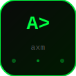
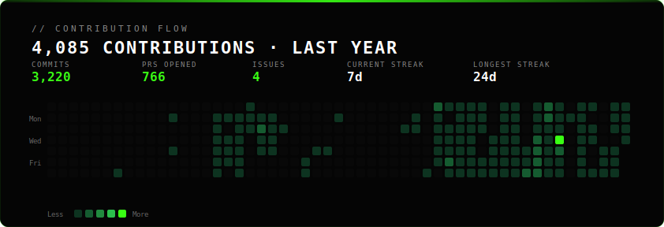

<!-- ════════════════ AXIOMID · ROOT AUTHORITY ════════════════ -->

  
  
   
  <h1>MOHAMED HOSSAM-ELDIN ABDELAZIZ</h1>
  <h3>محمد حسام الدين عبدالعزيز</h3>

  **`■ FOUNDER & SOVEREIGN ARCHITECT | AXIOMID`**
   
  `مؤسس ومعماري أنظمة الهوية السيادية`

   

  
  
  
  

    

  
  
  

    

  
  

 

## `00.` ABOUT THE ARCHITECT  ·  عن المعماري

**EN ·** I am a **Sovereign Systems Engineer** specializing in decentralized identity and autonomous AI ecosystems. My work sits at the intersection of cryptography, physics-inspired algorithms, and human-centric design. I build protocols that return sovereignty to the individual, starting with **AxiomID**.

**AR ·** أنا **مهندس نظم سيادية** متخصص في الهوية اللامركزية وأنظمة الذكاء الاصطناعي المستقلة. يقع عملي في نقطة التقاء التشفير، والخوارزميات المستوحاة من الفيزياء، والتصميم المتمحور حول الإنسان. أبني بروتوكولات تعيد السيادة للفرد، بدءاً من **AxiomID**.

### THE JOURNEY · الرحلة
**EN ·** From building multi-agent frameworks to architecting the L0 Root Authority of the AI era, my journey has been defined by one core principle: **"I didn't use AI as a tool. I used AI as a team."** This synergy allows for the rapid deployment of production-grade infrastructure that is both secure and self-evolving.

**AR ·** من بناء أطر العمل متعددة الوكلاء إلى هندسة سلطة الجذر (L0) لعصر الذكاء الاصطناعي، تميزت رحلتي بمبدأ أساسي واحد: **"ما استخدمتش الذكاء الاصطناعي كأداة. استخدمته كفريق."** هذا التناغم يسمح بالنشر السريع للبنية التحتية ذات المستوى الإنتاجي والآمنة والمتطورة ذاتياً.

 

  

 

  

 

## `01.` THE MISSION  ·  المهمة

**EN ·** AxiomID is the **Human Authorization Protocol**. We reject the dystopian future of hardware dependencies and iris scans. Instead, we architect a software-first, privacy-preserving ecosystem where reputation is earned through history, actions, and stakes. As the L0 Root Authority, AxiomID issues `did:axiom:axiomid.app:*` identifiers that empower humans to delegate authority to their AI agents securely and economically via the Pi Network.

**AR ·** مشروع **AxiomID** هو بروتوكول التفويض البشري. نحن نرفض المستقبل الديستوبي الذي يعتمد على مسح قزحية العين والأجهزة المعقدة. بدلاً من ذلك، نبني نظاماً بيئياً يعتمد على البرمجيات أولاً والحفاظ على الخصوصية، حيث تُكتسب السمعة من خلال التاريخ والأفعال والرهانات. بصفتها سلطة الجذر (L0)، تُصدر AxiomID معرّفات هويّة تُمكّن البشر من تفويض السلطة لوكلائهم الذكيين بأمان واقتصادية عبر شبكة Pi.

 

## `02.` HOW IT WORKS: THE PROCESS  ·  آلية العمل

**EN ·** AxiomID operates as a progressive trust engine. The process is designed to be frictionless yet cryptographically resilient.
1. **Connect:** Link your Pi Wallet. This establishes your cryptographic anchor.
2. **Verify:** Complete social and on-chain "Proof of Work" actions to build your Trust Score.
3. **Issue:** AxiomID issues a W3C-compliant DID (Decentralized Identifier).
4. **Delegate:** Use your Agent Passport to authorize AI agents to act on your behalf across the ecosystem.

**AR ·** تعمل AxiomID كمحرك ثقة تدريجي. تم تصميم العملية لتكون سلسة ولكن مرنة تشفيرياً.
1. **الربط:** ربط محفظة Pi الخاصة بك، مما يؤسس مرساك التشفيري.
2. **التحقق:** إكمال إجراءات "إثبات العمل" الاجتماعية والتقنية لبناء درجة الثقة الخاصة بك.
3. **الإصدار:** تُصدر AxiomID معرّف DID متوافق مع معايير W3C.
4. **التفويض:** استخدم جواز سفر الوكيل لتفويض وكلاء الذكاء الاصطناعي للعمل نيابة عنك.

 

## `03.` THE CONSORTIUM: HUMAN-AI SYNERGY  ·  فريق البناء: التناغم البشري الآلي

**EN ·** AxiomID is engineered by **1 human and 5 specialized AI agents** working in complete alignment. In this workflow, AI is not a tool but a peer. The human sets the vision and final authority, while the agents execute, verify, and evolve the codebase autonomously.

**AR ·** تم هندسة AxiomID بواسطة **إنسان واحد و5 وكلاء ذكاء اصطناعي متخصصين** يعملون في تناغم تام. في تدفق العمل هذا، الذكاء الاصطناعي ليس مجرد أداة بل هو زميل. يضع الإنسان الرؤية والسلطة النهائية، بينما يقوم الوكلاء بالتنفيذ والتحقق وتطوير الكود بشكل مستقل.

<table>
<tr>
<td align="center" width="200" valign="top">
  
    
  <b>Mohamed Abdelaziz</b>
   
  Founder & Lead Architect المؤسس والمعماري الأول
</td>
<td align="center" width="180" valign="top">
  
    <b>Jules v0</b> 
  🔁 Autonomous Agent Code Generation & Security
</td>
<td align="center" width="180" valign="top">
  
    <b>Gemini</b> 
  🧠 Code Auditor Quality & Verification
</td>
</tr>
<tr>
<td align="center" width="180" valign="top">
  
    <b>CodeRabbit</b> 
  🐇 PR Reviewer Continuous Feedback
</td>
<td align="center" width="180" valign="top">
  
    <b>OpenCode</b> 
  🌐 Agent Platform Autonomous Execution
</td>
<td align="center" width="180" valign="top">
  
    <b>Antigravity</b> 
  🚀 Agentic IDE Mission Control
</td>
</tr>
</table>

 

## `04.` PROJECTED TELEMETRY  ·  القياسات المتوقعة

**EN ·** Illustrative roadmap targets for the AxiomID Root Authority — *not* live network data. The dashboard is refreshed every 3 hours by an automated workflow to keep the projection layout current.

**AR ·** أهداف توضيحية لخارطة طريق سلطة الجذر AxiomID — وليست بيانات شبكة حية. تُحدَّث اللوحة كل 3 ساعات عبر تدفق عمل آلي للحفاظ على تخطيط الإسقاط محدَّثاً.

  

<!-- START_LIVE_DATA -->

| AxiomID Layer | Metric | Projected Value | Status |
| :--- | :--- | :--- | :--- |
| **L0 Identity** | Active Citizens | `13,341` | 🟢 PROJECTED |
| **L0 Authority** | Registered Agents | `4,107` | 🤖 PROJECTED |
| **L0 Economy** | M2M Transactions | `41,024` | 💸 PROJECTED |
| **L0 Network** | Last Refresh | `2026-06-19 15:59:42 UTC` | 📡 SYNCED |

<i>Illustrative roadmap targets — not live network data. Refreshed every 3 hours.</i>

<!-- END_LIVE_DATA -->

 

## `05.` PHYSICS-BASED TRUST  ·  الثقة القائمة على الفيزياء

**EN ·** AxiomID leverages principles from thermodynamics and information theory to power its trust algorithms.

**AR ·** تعتمد AxiomID على مبادئ من الديناميكا الحرارية ونظرية المعلومات لتشغيل خوارزميات الثقة الخاصة بها.

<table>
  <thead>
    <tr>
      <th>Pillar / الركيزة</th>
      <th>Algorithm / الخوارزمية</th>
      <th>Application / التطبيق</th>
    </tr>
  </thead>
  <tbody>
    <tr>
      <td><b>Thermodynamics</b></td>
      <td>Ideal Gas Law (PV=nRT)</td>
      <td>Adaptive rate limit capacity. / سعة الطلبات المتكيفة.</td>
    </tr>
    <tr>
      <td><b>Information Theory</b></td>
      <td>Shannon Entropy</td>
      <td>Identity verification density. / كثافة التحقق من الهوية.</td>
    </tr>
    <tr>
      <td><b>Stochastic Dynamics</b></td>
      <td>Langevin Equation</td>
      <td>Trust evolution over time. / تطور الثقة عبر الزمن.</td>
    </tr>
  </tbody>
</table>

 

## `06.` SYSTEM ARSENAL  ·  الترسانة التقنية

**Stack · التقنيات**
 

 

  

<!-- ════════════════ /AXIOMID ROOT AUTHORITY ════════════════ -->
